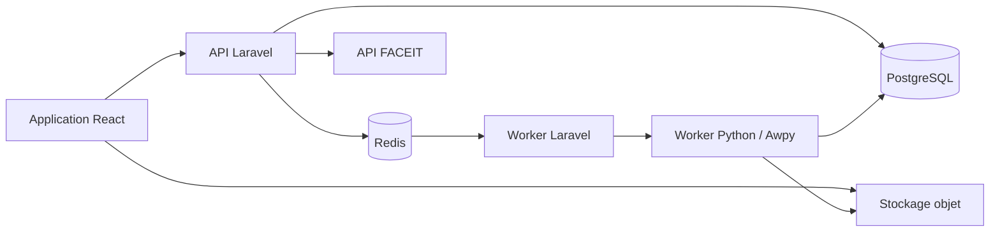

# Clutch.

Clutch. est une application web d'analyse de parties Counter-Strike 2. Son objectif est de permettre à un joueur de revoir rapidement ses matchs dans un lecteur radar 2D, de comprendre ses performances et d'obtenir des axes d'amélioration concrets et vérifiables.

Le produit s'inspire de l'expérience de lecture et d'analyse proposée par Skybox et Refrag, avec une première version centrée sur le joueur individuel.

## État du projet

Le dépôt contient actuellement le socle Laravel de l'application. Les fonctionnalités métier, le frontend React et le moteur d'analyse des démos restent à implémenter.

La première bêta sera gratuite, accessible sur invitation et limitée par des quotas afin de contrôler les coûts de traitement et de stockage.

## Suivi du développement

- [Projet GitHub — Clutch. MVP](https://github.com/users/koulaw/projects/8)
- [Issues du repository](https://github.com/koulaw/clutch/issues)
- [Milestones](https://github.com/koulaw/clutch/milestones)

Le projet GitHub regroupe les 38 issues du MVP, organisées par priorité, domaine et étape de livraison. Chaque issue contient ses critères d'acceptation et ses dépendances.

## Objectifs du MVP

- Importer manuellement une démo CS2, puis automatiser l'import des matchs FACEIT.
- Supporter les cartes du pool compétitif CS2.
- Rejouer un match round par round dans un radar 2D interactif.
- Présenter les statistiques générales, mécaniques, tactiques et liées aux utilitaires.
- Proposer au maximum trois axes d'amélioration prioritaires par match.
- Relier chaque recommandation à des statistiques, des rounds et des timestamps précis.
- Garder les matchs privés par défaut et permettre leur partage avec un lien révocable en lecture seule.

## Lecteur radar 2D

Le lecteur devra notamment proposer :

- les positions, orientations, équipes, points de vie et équipements des joueurs ;
- la bombe, les tirs, les kills et les trajectoires des grenades ;
- les smokes, molotovs et effets de flash ;
- une sélection par round et une timeline déplaçable ;
- lecture, pause et vitesses de 0,25× à 4× ;
- des raccourcis clavier et des marqueurs pour les événements importants ;
- des filtres par équipe et joueur, ainsi qu'un mode rayons X ;
- des liens directs vers l'instant associé à une statistique ou une recommandation.

Les radars et leurs transformations de coordonnées seront versionnés afin d'éviter d'afficher une démo avec une version incorrecte de la carte.

## Statistiques et coaching

### Performance générale

- K/D/A, ADR, KAST, headshots et précision ;
- impact par round, multi-kills et clutches ;
- résultats par côté, carte, arme et type de round.

### Duels et fondamentaux

- duels d'ouverture tentés et gagnés ;
- first deaths ;
- trades réalisés, reçus ou manqués ;
- morts non échangeables et impact sur le round.

### Mécanique

- tirs en mouvement et qualité du contre-strafe ;
- précision du premier tir et comportement des bursts ;
- placement du viseur lors de la première visibilité d'un adversaire ;
- délai entre la visibilité d'un adversaire et les premiers dégâts.

### Utilitaires et tactique

- dégâts d'utilitaires, ennemis flashés et durée des flashs ;
- utilitaires conservés au moment de la mort ;
- efficacité des smokes et molotovs ;
- distance entre coéquipiers, tradeabilité et timings de rotation ;
- positionnement pendant les prises et reprises de site ;
- heatmaps de positions et d'événements.

Le coaching du MVP reposera sur des règles déterministes et configurables, sans modèle génératif. Chaque recommandation comportera un constat chiffré, un niveau de confiance, une action concrète et les séquences qui la justifient. Les seuils génériques pourront ensuite être remplacés par des références adaptées à la carte, au rôle et au niveau FACEIT.

## Architecture cible

### Application web

- PHP 8.3 et Laravel 13 pour l'authentification, les autorisations, l'API et l'orchestration.
- React, TypeScript et Inertia pour l'interface applicative.
- Tailwind CSS pour le design system de Clutch.
- Canvas/WebGL, avec PixiJS, pour le rendu performant du radar.
- PostgreSQL pour les données métier et Redis pour les queues, le cache et la progression des analyses.

### Moteur d'analyse

- Worker Python isolé utilisant [Awpy](https://github.com/pnxenopoulos/awpy).
- Parsing des informations du match, rounds, événements et positions tick par tick.
- Calcul des statistiques, données de visibilité, navigation et heatmaps.
- Contrat versionné entre Laravel et le worker avec `schema_version` et `parser_version`.
- Exécution dans un conteneur limité en CPU, mémoire, durée et accès réseau.

### Stockage des résultats

- Statistiques, événements consultables et recommandations dans PostgreSQL.
- Données analytiques complètes au format Parquet dans un stockage objet compatible S3.
- Données du lecteur découpées et compressées par round.
- Positions du lecteur échantillonnées à 16 images par seconde, puis interpolées dans le navigateur.

## Pipeline d'une démo

1. Laravel génère une URL temporaire d'upload vers le stockage objet.
2. L'application valide la taille, l'extension, l'en-tête du fichier et son checksum SHA-256.
3. Une analyse passe par les états `uploaded`, `queued`, `parsing`, `analyzing`, `ready`, `failed` ou `unsupported`.
4. Un job Laravel déclenche le worker Awpy sur un réseau privé.
5. Le worker produit les événements, statistiques et fichiers nécessaires au lecteur.
6. Laravel publie la progression et rend le rapport disponible.
7. En cas d'échec, l'analyse peut être relancée sans dupliquer les données.

La taille maximale initiale d'une démo sera de 500 Mo. Les fichiers bruts seront conservés pendant 30 jours ; les résultats resteront disponibles jusqu'à leur suppression par l'utilisateur.

## Comptes et intégrations

- Inscription par email avec vérification de l'adresse.
- Association du compte Steam avant l'activation des imports automatiques.
- Recherche du profil FACEIT depuis le Steam ID.
- Synchronisation périodique de l'historique FACEIT et téléchargement des nouvelles démos disponibles.
- Matchs privés par défaut.
- Liens de partage non devinables, révocables et limités à la lecture.
- Limites initiales de cinq imports par jour et trente analyses conservées par utilisateur.

L'import automatique des matchs Premier sera étudié après FACEIT. Il nécessite notamment un Steam ID, un code d'authentification de jeu et un code de partage de match.

## API prévue

| Méthode | Route | Fonction |
| --- | --- | --- |
| `POST` | `/api/v1/demos/upload-url` | Préparer l'envoi direct d'une démo |
| `POST` | `/api/v1/demos` | Confirmer l'envoi et lancer l'analyse |
| `GET` | `/api/v1/demos/{demo}` | Obtenir l'état et la progression |
| `GET` | `/api/v1/demos/{demo}/rounds/{round}/replay` | Charger les données d'un round |
| `GET` | `/api/v1/demos/{demo}/report` | Consulter statistiques et recommandations |
| `POST` | `/api/v1/demos/{demo}/share` | Créer un lien de partage |
| `DELETE` | `/api/v1/demos/{demo}/share` | Révoquer le lien de partage |
| `POST` | `/api/v1/integrations/steam` | Associer un compte Steam |
| `DELETE` | `/api/v1/integrations/steam` | Supprimer l'association Steam |
| `POST` | `/api/v1/integrations/faceit` | Activer la synchronisation FACEIT |
| `DELETE` | `/api/v1/integrations/faceit` | Désactiver la synchronisation FACEIT |

## Feuille de route

### 1. Fondations et preuve technique — 1 à 2 semaines

- Mettre en place l'authentification, React/TypeScript/Inertia, PostgreSQL, Redis et le stockage objet.
- Créer le worker Awpy et valider plusieurs démos FACEIT et Premier.
- Définir le contrat de sortie et constituer un jeu de démos de référence.

### 2. Première version du lecteur — 3 à 4 semaines

- Réaliser le parcours complet upload, parsing et lecture d'un match.
- Implémenter le radar, les joueurs, la timeline, les événements et les contrôles.
- Valider une première carte avant de généraliser le système de coordonnées.

### 3. Statistiques et coaching — 4 à 6 semaines

- Ajouter les métriques générales, mécaniques, tactiques et d'utilitaires.
- Construire le moteur de règles et les preuves temporelles.
- Étendre et vérifier le lecteur sur tout le pool compétitif.

### 4. Expérience bêta — 2 à 3 semaines

- Ajouter invitations, quotas, partage, notifications et gestion des erreurs.
- Intégrer Steam et la synchronisation FACEIT.
- Ajouter l'observabilité et le nettoyage automatique des fichiers.

### 5. Stabilisation — environ 2 semaines

- Tester la charge, la sécurité des uploads et la compatibilité des navigateurs.
- Optimiser les performances du lecteur.
- Corriger les écarts de parsing selon les cartes et versions de CS2.
- Ouvrir progressivement les invitations.

L'objectif estimé pour une bêta solo utilisable est de 12 à 17 semaines, hors finalisation détaillée du design.

## Qualité et critères d'acceptation

- Tests Pest pour les autorisations, uploads, quotas, partages, jobs et intégrations.
- Tests Pytest du worker avec des démos figées couvrant les cartes supportées et les cas d'erreur.
- Tests contractuels entre Laravel et le worker Python.
- Tests React et navigateur du lecteur, de la timeline et des raccourcis.
- Comparaison automatique des scores, kills, dégâts et rounds avec les démos de référence.
- 95 % des démos supportées prêtes en moins de cinq minutes après leur upload.
- Chargement d'un round en moins de deux secondes sur une connexion standard.
- Rendu ciblé à 60 FPS sur un ordinateur récent.
- Toute recommandation doit renvoyer vers au moins un événement vérifiable dans le lecteur.
- Toute erreur de parsing doit être explicite et relançable.

## Après le MVP

- Import automatique des matchs Premier.
- Profils publics et historique longitudinal des performances.
- Comparaisons par rôle, niveau et carte.
- Espaces d'équipe, annotations collaboratives, playlists et playbooks.
- Analyse d'adversaires et outils d'anti-strat.
- Modèles statistiques ou prédictifs lorsque le volume de données sera suffisant.

## Références

- [Awpy — parsing, analytics et visualisation CS2](https://github.com/pnxenopoulos/awpy)
- [FACEIT Data API](https://docs.faceit.com/docs/data-api/data/)
- [Accès à l'historique des matchs Counter-Strike via Steam](https://developer.valvesoftware.com/wiki/Counter-Strike%3A_Global_Offensive_Access_Match_History)
- [Refrag 2D Demo Viewer](https://refrag.gg/blog/introducing-the-refrag-2d-demo-viewer/)
- [Skybox EDGE](https://www.skybox.gg/edge/)
